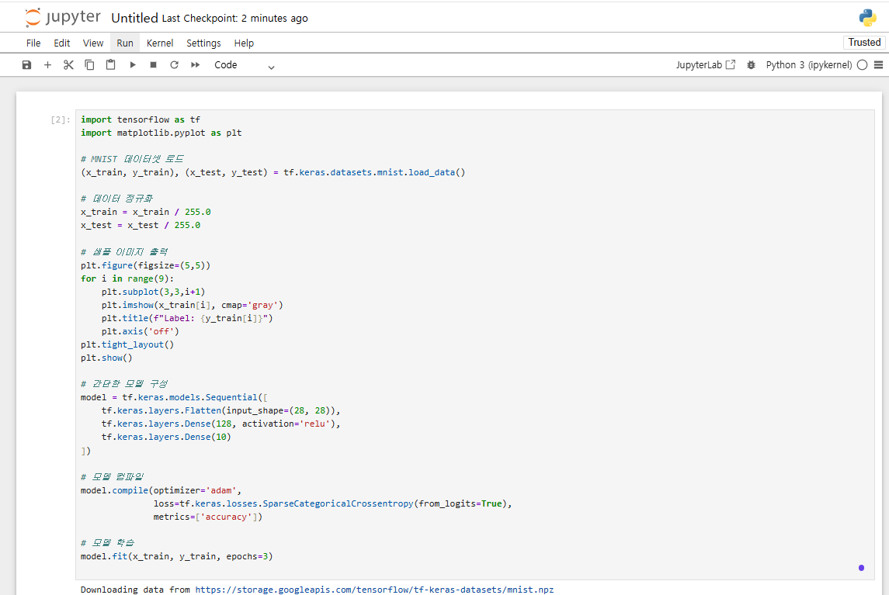
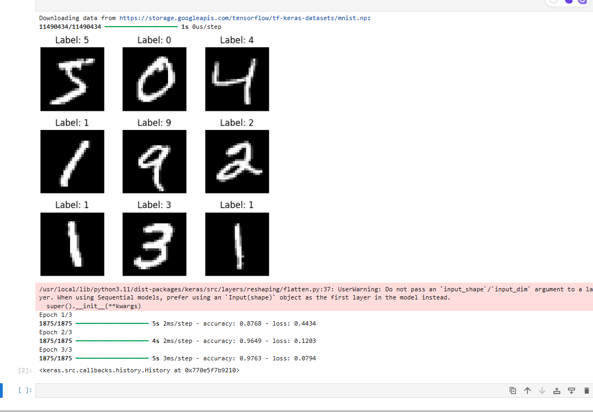
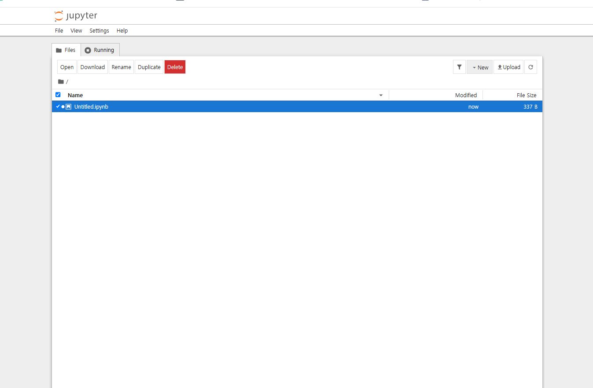

# Jupyter-Notebook-Settings-on-AWS-EC2

GPU승인까지 시간이 걸려서 사정상 CPU로 진행한 실습

## 사전 준비

* AWS 계정
* `.pem` 키페어 파일 생성 또는 보유
* 로컬에 SSH 클라이언트 설치 (Windows: Git Bash, macOS/Linux: 기본 내장)

---

## 🧾 EC2 인스턴스 생성 (웹 콘솔)

1. EC2 > Launch Instance
2. AMI: `Ubuntu Server 20.04 LTS`
3. Instance Type: `t2.medium` 또는 `t3.large`
4. 키페어: 새로 생성하거나 기존 키 사용
5. 스토리지: 기본 8\~10GB 이상
6. 보안 그룹 설정:

   * SSH (22) → My IP
   * Custom TCP (8800) → Anywhere (0.0.0.0/0)

---

## 🔐 EC2 접속 및 환경 구성

### ▶ SSH 접속

```bash
chmod 400 your-key.pem
```

> `.pem` 키 파일의 권한을 소유자만 읽기 가능하도록 설정 (보안상 필수)

```bash
ssh -i your-key.pem ubuntu@<EC2-Public-IP>
```

> EC2 인스턴스에 SSH를 통해 원격 접속

---

### ▶ Docker 설치

```bash
sudo apt update
```

> 패키지 목록 업데이트

```bash
sudo apt install -y docker.io
```

> Docker 패키지 설치

```bash
sudo usermod -aG docker ubuntu
```

> 현재 사용자(ubuntu)를 Docker 그룹에 추가

```bash
newgrp docker
```

> 그룹 권한을 현재 터미널 세션에 적용

---

### ▶ TensorFlow + Jupyter 이미지 다운로드 (CPU용)

```bash
docker pull tensorflow/tensorflow:latest-jupyter
```

> TensorFlow + Jupyter 환경이 사전 구성된 Docker 공식 이미지 (CPU 버전) 다운로드

---

### ▶ 작업 디렉토리 생성

```bash
mkdir -p ~/jupyter
```

> 호스트(EC2)에 Jupyter 노트북 데이터를 저장할 디렉토리 생성

---

### ▶ Docker 컨테이너 실행

```bash
docker run -it -d -p 8800:8888 --name tensorflow-cpu-jupyter -v /home/ubuntu/jupyter:/tf/ tensorflow/tensorflow:latest-jupyter
```
오타와 공백을 주의해야함  

#### 각 옵션 설명:

| 옵션                                     | 의미                                           |
| -------------------------------------- | -------------------------------------------- |
| `-it`                                  | 터미널 세션 유지 (interactive + TTY)                |
| `-d`                                   | 백그라운드 실행                                     |
| `-p 8800:8888`                         | 호스트 8800 포트를 컨테이너 8888포트와 연결 (Jupyter 기본 포트) |
| `--name tensorflow-cpu-jupyter`        | 컨테이너 이름 지정                                   |
| `-v /home/ubuntu/jupyter:/tf/`         | 호스트와 컨테이너 간 디렉토리 마운트 (Jupyter의 루트 폴더로 연결됨)   |
| `tensorflow/tensorflow:latest-jupyter` | 사용할 Docker 이미지 이름                            |

---

## 🔍 Jupyter Token 확인 및 웹 접속

### ▶ 컨테이너 내부 진입

```bash
docker exec -it tensorflow-cpu-jupyter /bin/bash
```

> 실행 중인 컨테이너에 접속하여 내부에서 명령어를 실행할 수 있도록 함

### ▶ Token 확인

```bash
jupyter notebook list
```

> 실행 중인 Jupyter Notebook 서버 URL과 Token을 확인할 수 있음

### ▶ 웹 브라우저 접속

```
http://<EC2-Public-IP>:8800/?token=<복사한 토큰>
```

> 위 URL로 브라우저 접속 시 Jupyter 웹 인터페이스 확인 가능

---

## 📊 Python 테스트 코드 (Jupyter에 입력)

```python
import tensorflow as tf
import matplotlib.pyplot as plt

(x_train, y_train), (x_test, y_test) = tf.keras.datasets.mnist.load_data()

x_train = x_train / 255.0
x_test = x_test / 255.0

plt.figure(figsize=(5,5))
for i in range(9):
    plt.subplot(3,3,i+1)
    plt.imshow(x_train[i], cmap='gray')
    plt.title(f"Label: {y_train[i]}")
    plt.axis('off')
plt.tight_layout()
plt.show()

model = tf.keras.models.Sequential([
    tf.keras.layers.Flatten(input_shape=(28, 28)),
    tf.keras.layers.Dense(128, activation='relu'),
    tf.keras.layers.Dense(10)
])

model.compile(optimizer='adam',
              loss=tf.keras.losses.SparseCategoricalCrossentropy(from_logits=True),
              metrics=['accuracy'])

model.fit(x_train, y_train, epochs=3)
```

---

## 🛑 종료 시 주의 사항

* EC2 인스턴스를 "Stop" 하면 인스턴스 요금은 발생하지 않지만 **EBS 스토리지 요금은 계속 발생**
* 비용을 완전히 막고 싶다면 `Terminate` 필요 (이 경우 데이터도 삭제됨)

---

## 📸 실습 결과 캡처

아래는 Jupyter Notebook을 통해 MNIST 데이터를 시각화하고 학습을 성공적으로 수행한 결과 화면입니다. GitHub `screenshots/` 폴더에 저장된 이미지입니다.

### ▶ 학습 샘플 이미지 출력



### ▶ 학습 정확도 출력 결과 (Epoch 진행 과정)



### ▶ 실행한 노트북 파일 상태



---

이 문서는 AWS EC2 환경에서 머신러닝 실습을 위한 기본 CPU 세팅을 반복 가능하게 구성하기 위한 실습 가이드입니다. 각 명령어마다 부가 설명이 포함되어 있어 초보자도 이해하며 따라할 수 있도록 구성하였으며, 추후 GPU 버전으로의 확장도 가능합니다.
